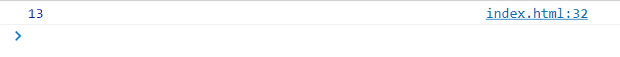

# 学会使用 JavaScript
现在请让我们使用 JavaScript 实现一个警示框的效果, 我想我们在之前的章节中提到了, 不过我现在要说的不是如何去实现这个警示框, 而是将之前文章中所提到的 JavaScript 代码进行实践

如果你不喜欢我的创建方法, 没有任何关系, 按你的来

我们第一步在桌面右击新建一个文本文档, 将其后缀名改为 `html` , 然后拖拽到 VSCode 中


***tips : 我们可以输入英文感叹号, 来立即生成一个文档架构***


因为这是一个专注于 JavaScript 的仓库, 所以我并不打算在这里讲述HTML、CSS的基础知识, 如果大家有需要, 后续可以进行更新

我想现在页面是一张白纸, 让他变得好看点

***如果你需要这个页面, 那么我想他就在当前小概念仓库中***


我已经迫不及待了, 让我们开始 JavaScript 之旅吧
```HTML
<script>
  let str = 'Hello JavaScript'
  if(str === 'Hello JavaScript') alert('JavaScript是如此的有趣')
</script>
```
将这段代码书写到你的 `html` 页面中, 请原谅我这么唠叨, 现在我们并不需要知道这段代码是什么意思, 我们只需要按照步骤来一起玩一些好玩的 ( _目前没有放置在哪个位置的要求_ ) 


我们发现有些人喜欢在语句结束之后加分号, 而有些人不喜欢加, 对于这一点, JavaScript 并没有强制的要求

( _加分号_ ) 就像这样
```HTML
<script>
  let str = 'Hello JavaScript';
  if(str === 'Hello JavaScript') alert('JavaScript是如此的有趣');
</script>
```

总之我们看到了刚才的效果, 当我们使用浏览器打开当前页面的时候, 会先弹出一个警示框, 当你点击确认(也就是当你默认阅读警示)之后才会显示出我们所编辑的页面

哦, 我们之前不仅仅提到了这段语句, 好像还有一条数学运算语句,你还记得吗 ? 

就像这样
```JS
20 * 6 / 8 -2
```
那么让我们把它书写在 JavaScript 区域中, 也许并没有你想象得那么简单, 比如 -- 你知道这段数学公式的计算结果会被输出到哪里去吗 ?

去实践吧----
```JS
<script>
  let str = 'Hello JavaScript'
  if(str === 'Hello JavaScript') alert('JavaScript是如此的有趣')

  20 * 6 / 8 -2
</script>
```

之前章节的演示中, 我们在开发者工具控制台中可以找到运算的结果, 那么现在它的运算结果在哪里 ?

如果你去实践了, 你就会发现, 它不在警示框中、也不在页面中、甚至控制台也没有打印出它的结果, 为什么呢 ？

- 控制台只是一个环境, 它可以用来执行一些短小的语句并立即显示结果
- 并且我们并没有告诉 JavaScript 应该把结果输出到哪里, 你只是给了它一个运算式
- 我们需要用一个特殊的函数来告知 JavaScript 将结果输出到控制台中-- ***console.log()***

我们来调用这个函数 `console,log()` 
```JS
<script>
  let str = 'Hello JavaScript'
  if(str === 'Hello JavaScript') alert('JavaScript是如此的有趣')

  console.log(20 * 6 / 8 -2)
</script>
```

没错, 这次它在控制台中打印出来了


我想初学者现在会比较疑惑, 我决定为此来做一下解释:

- 我们在上一章其实是处于控制台中进行输出输入的,所以立即就可以在控制台中获取到结果 ; 但是本章节我们并没有身处控制台,而是在 script 脚本中, 所以需要调用 `console.log()`

- 在控制台也是不需要脚本标签(script)的, 不是吗 ? 
- `console.log()` 相当于链接了脚本与浏览器端控制台的一座桥梁

---
## JavaScript 脚本可以放到哪里 ? 🎫
上面演示的方法我们称为内嵌式, 它的优点是我们不需要另外创建其他文件, 在做一些例子的时候较为方便 ; 同时在整个页面的整洁与逻辑方面是比较差的

我们常用的的还有一种方式叫做外链式

外链式就是将 JavaScript 脚本放到一个单独的文件中, 并在html文件中导入他, 不要担心, 我会一步一步来

1. 我们点击打开侧边栏


2. 右击新建一个后缀名为.js文件


3. 把 html 中的脚本文件剪切粘贴到新建的.js脚本文件 ( _需要注意 ： 不需要script脚本标签了, 因为当前处于一个 JavaScript 脚本文件中_ )


4. 建立 html 页面与 JS 脚本文件之间的联系 ( _因为现在 html 无法知道 JS 脚本处于哪里, 我们需要告知 html JS所处的实际位置_ ), 我们通常在文本下引入 JS 文件, 然后指定它的路径
```HTML
<body>
  <h1>Hello I hope you can learn something from me</h1>
  // src : 路径
  <script src="./index.js"></script>
</body>
```

现在我们可以更好的关注于逻辑的处理上, 从长远来看, 这更加便于后期的维护

---
## 结束 🎉
OK, 到这里你已经学会了如何在 HTML 页面中使用 JavaScript 脚本文件了, 意味着你现在可以进行真正的 JavaScript 学习之旅

下章见 ！ 