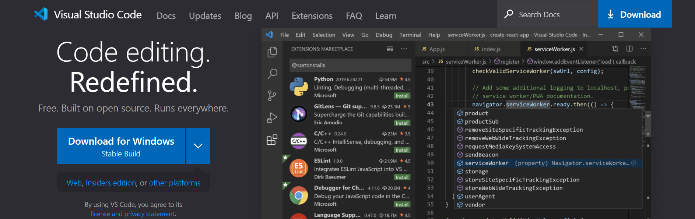

# VSCode代码编辑器
首先我们需要安装配置一个代码编辑器

这是任何开发人员必备的工具, 用来编辑我们的代码

我建议大家使用Visual Studio Code, 如果你有其他的选择也是OK的

---
## 主题
设置一个你喜欢的主题颜色, 我觉得这可以让你的编码更加的舒服 : 

如果VSCode自带的主题不能满足需求的话, 你可以尝试去插件库( _就是上图四个小方格的选项_ )中寻找一些适合你的主题

当然, 你会发现为什么我的VSCode是中文的 ? 

我们可以在插件库中寻找到这个插件然后安装上它, 并重启VSCoed便可以了

---
## 设置
设置会让我们的编码更加的顺利, 所以我认为这是必备的

我们尝试点击设置 : 

### 自动保存

当失去焦点的时候( _也就是当你切换其他软件或者关闭编辑器时会自动的保存代码_ ), 不需要我们做任何多余的操作

### 格式化代码
代码格式化是非常重要的

如果你想要编写漂亮代码的话, 那就勾选上它, 在之后我们会真正的用到它

在我们保存文件的时候, 编辑器会自动的帮我们去格式化规范代码